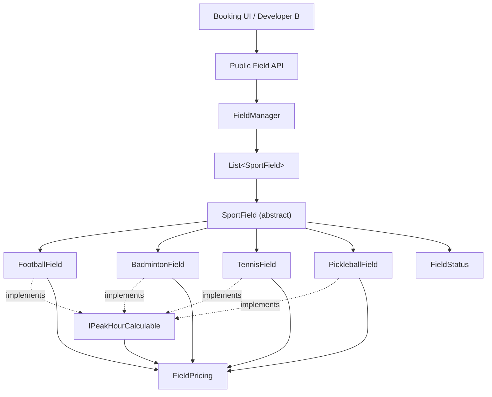
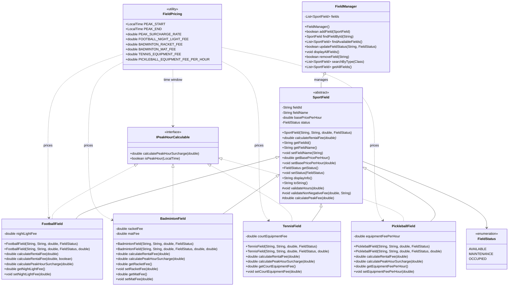
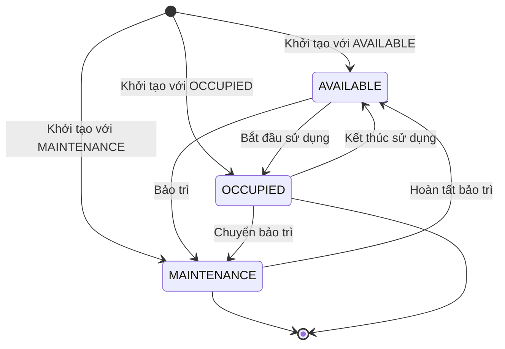
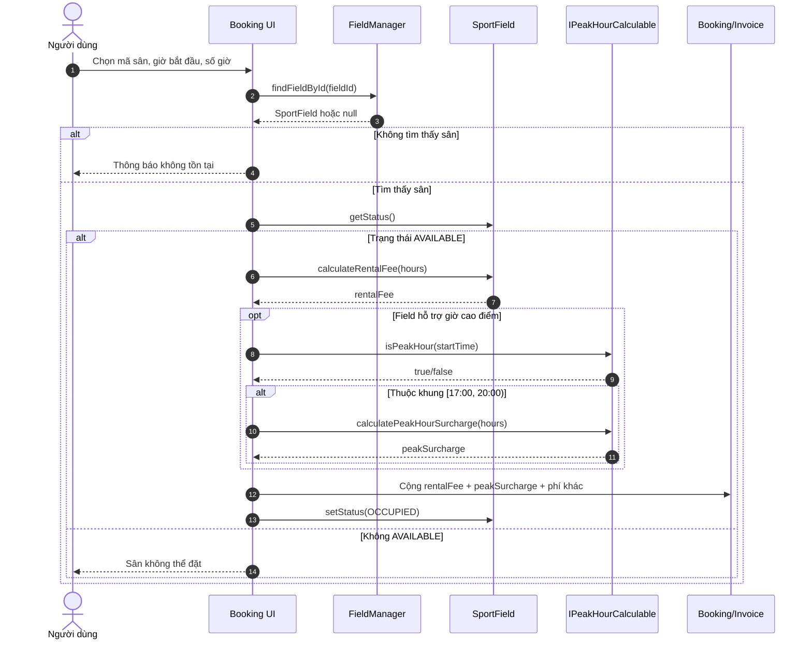
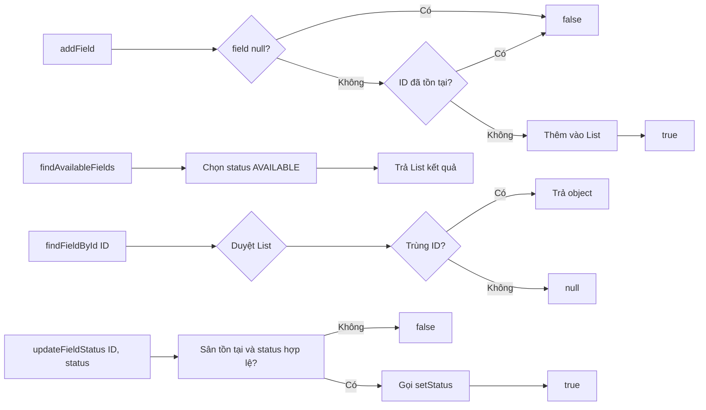

# SmartSportHub — Field Domain

> Java Console Application cho bài kiểm tra giữa kỳ môn **Lập trình Hướng đối tượng (OOPR240279)**.  
> Repository: https://github.com/Moseyuh333/OOP_GK  
> Phạm vi hiện tại: **Part A — Field Domain**.

SmartSportHub mô phỏng nghiệp vụ quản lý sân thể thao. Phần Field Domain chịu trách nhiệm mô tả dữ liệu sân, trạng thái, công thức tính tiền, phụ phí giờ cao điểm và thao tác quản lý danh sách sân. Phần Booking/Billing của Developer B sẽ sử dụng API ổn định từ module này.

---

## 1. Mục tiêu đã đạt

- Thể hiện rõ **Abstraction** bằng abstract class `SportField`.
- Thể hiện rõ **Encapsulation** bằng private fields, getter/setter và validation.
- Thể hiện rõ **Inheritance** bằng bốn subclass cùng kế thừa `SportField`.
- Thể hiện rõ **Polymorphism** trong `calculateRentalFee(double hours)`.
- Tách khả năng giờ cao điểm bằng interface `IPeakHourCalculable`.
- Quản lý sân bằng `FieldManager` và `List<SportField>`.
- Không phụ thuộc `Scanner`, GUI, database, framework hoặc phần Booking/Billing.
- Có API contract rõ ràng để Developer B tích hợp độc lập.

---

## 2. Phân tích thiết kế

### 2.1. Abstraction

`SportField` là abstract class chứa các thuộc tính dùng chung:

- `fieldId`
- `fieldName`
- `basePricePerHour`
- `status`

Lớp này khai báo phương thức trừu tượng:

```java
public abstract double calculateRentalFee(double hours);
```

Không thể khởi tạo trực tiếp:

```java
// Không hợp lệ vì SportField là abstract
// SportField field = new SportField(...);
```

Client phải khởi tạo một subclass cụ thể như `FootballField`, `BadmintonField`, `TennisField` hoặc `PickleballField`.

### 2.2. Encapsulation

Các thuộc tính nội bộ của mỗi sân đều được khai báo `private`. Dữ liệu chỉ được truy cập qua public API:

```java
SportField field = manager.findFieldById("F001");
String name = field.getFieldName();
field.setFieldName("Sân bóng số 1");
```

Mỗi setter có validation để object không rơi vào trạng thái dữ liệu vô lý:

| Dữ liệu | Điều kiện |
|---|---|
| `fieldId` | Không `null`, không rỗng, bất biến sau khi tạo |
| `fieldName` | Không `null`, không rỗng |
| `basePricePerHour` | Hữu hạn và lớn hơn 0 |
| `status` | Không `null` |
| `hours` | Hữu hạn và lớn hơn 0 |
| Các khoản phụ phí | Hữu hạn và không âm |

Validation dùng:

```java
throw new IllegalArgumentException("Thông báo lỗi");
```

`fieldId` không có setter vì đây là định danh nghiệp vụ. Giữ ID bất biến giúp `FieldManager` không bị mất tính duy nhất sau khi sân đã được thêm.

### 2.3. Inheritance

Cả bốn loại sân đều kế thừa `SportField`:

- `FootballField extends SportField`
- `BadmintonField extends SportField`
- `TennisField extends SportField`
- `PickleballField extends SportField`

Nhờ đó, `FieldManager` có thể lưu các loại sân khác nhau trong cùng một `List<SportField>` mà không cần abstraction repository phức tạp.

### 2.4. Polymorphism

Client giữ reference kiểu `SportField` nhưng mỗi object thực tế thực hiện công thức khác nhau:

```java
List<SportField> fields = List.of(
        new FootballField("F001", "Sân bóng", 100_000, FieldStatus.AVAILABLE, 50_000),
        new BadmintonField("B001", "Sân cầu lông", 80_000, FieldStatus.AVAILABLE, 20_000, 10_000),
        new TennisField("T001", "Sân tennis", 150_000, FieldStatus.AVAILABLE, 40_000),
        new PickleballField("P001", "Sân pickleball", 120_000, FieldStatus.AVAILABLE, 15_000)
);

for (SportField field : fields) {
    double fee = field.calculateRentalFee(2);
    // JVM gọi override tương ứng với loại sân thật.
}
```

Công thức hiện tại:

| Loại sân | Công thức `calculateRentalFee(hours)` |
|---|---|
| Football | `basePricePerHour × hours` |
| Badminton | `basePricePerHour × hours + racketFee + matFee` |
| Tennis | `basePricePerHour × hours + courtEquipmentFee` |
| Pickleball | `(basePricePerHour + equipmentFeePerHour) × hours` |

Football có phương thức mở rộng để Booking cộng phí đèn khi thực sự sử dụng:

```java
public double calculateRentalFee(double hours, boolean useNightLight);
```

### 2.5. Interface

`IPeakHourCalculable` đại diện cho khả năng tính phụ phí giờ cao điểm:

```java
public interface IPeakHourCalculable {
    double calculatePeakHourSurcharge(double hours);
    default boolean isPeakHour(LocalTime time);
}
```

Cả bốn subclass hiện đều hỗ trợ khả năng này. Phí giờ cao điểm được **tách khỏi** `calculateRentalFee()`:

```java
double rentalFee = field.calculateRentalFee(hours);

if (field instanceof IPeakHourCalculable peak && peak.isPeakHour(startTime)) {
    double peakFee = peak.calculatePeakHourSurcharge(hours);
}
```

Nhờ cách tách này, Developer B quyết định thời điểm áp dụng phí khi tạo Booking/Invoice mà không sửa Field Domain.

---

## 3. Cấu trúc thư mục

```text
OOP_GK/
├── LICENSE
├── README.md
├── FIELD_DOMAIN_API.md
├── .gitignore
├── src/
│   └── smartsporthub/
│       ├── interfaces/
│       │   └── IPeakHourCalculable.java
│       ├── manager/
│       │   └── FieldManager.java
│       └── model/
│           ├── SportField.java
│           ├── FootballField.java
│           ├── BadmintonField.java
│           ├── TennisField.java
│           ├── PickleballField.java
│           ├── FieldStatus.java
│           └── FieldPricing.java
└── test/
    └── smartsporthub/
        └── test/
            └── FieldDomainTest.java
```

---

## 4. Sơ đồ kiến trúc package



---

## 5. Class diagram đầy đủ



---

## 6. Sơ đồ trạng thái sân



---

## 7. Luồng tính tiền và giờ cao điểm



Công thức tổng quát do Developer B sử dụng:

```text
subtotal = field.calculateRentalFee(hours)
peakSurcharge = 0

nếu field là IPeakHourCalculable và isPeakHour(bookingStartTime):
    peakSurcharge = field.calculatePeakHourSurcharge(hours)

total = subtotal + peakSurcharge + các phí Booking/Billing khác
```

---

## 8. Sơ đồ quản lý sân



---

## 9. Quy tắc nghiệp vụ và cấu hình

### 9.1. Khung giờ cao điểm

- Bắt đầu: `17:00`
- Kết thúc: `20:00`
- Biên trái đóng, biên phải mở: `[17:00, 20:00)`.
- Tỷ lệ phí: `20% × basePricePerHour × hours`.

### 9.2. Mức phí mặc định

| Hạng mục | Giá trị mặc định |
|---|---:|
| Phí đèn football | 50.000 VND/lượt |
| Phí vợt badminton | 20.000 VND/lượt |
| Phí thảm badminton | 10.000 VND/lượt |
| Phí thiết bị tennis | 40.000 VND/lượt |
| Phí thiết bị pickleball | 15.000 VND/giờ |
| Phí giờ cao điểm | 20% tiền thuê theo giờ |

Các giá trị mặc định tập trung trong `FieldPricing`. Constructor có thể nhận giá riêng khi cần tạo dữ liệu khác nhau.

---

## 10. Public API chính

### 10.1. Tạo sân

```java
FootballField football =
        new FootballField("F001", "Sân bóng A", 100_000, FieldStatus.AVAILABLE, 50_000);

BadmintonField badminton =
        new BadmintonField("B001", "Sân cầu lông", 80_000, FieldStatus.AVAILABLE, 20_000, 10_000);

TennisField tennis =
        new TennisField("T001", "Sân tennis", 150_000, FieldStatus.AVAILABLE, 40_000);

PickleballField pickleball =
        new PickleballField("P001", "Sân pickleball", 120_000, FieldStatus.AVAILABLE, 15_000);
```

Mỗi loại cũng có constructor dùng mức phí mặc định:

```java
new FootballField("F002", "Sân bóng B", 100_000, FieldStatus.AVAILABLE);
```

### 10.2. Tìm và cập nhật sân

```java
FieldManager manager = new FieldManager();
manager.addField(football);

SportField field = manager.findFieldById("F001");
manager.findAvailableFields();
manager.updateFieldStatus("F001", FieldStatus.MAINTENANCE);
manager.removeField("F001");
manager.searchByType(FootballField.class);
```

### 10.3. Tính tiền

```java
double rentalFee = field.calculateRentalFee(hours);
```

### 10.4. Phí giờ cao điểm

```java
if (field instanceof IPeakHourCalculable peak && peak.isPeakHour(startTime)) {
    double peakFee = peak.calculatePeakHourSurcharge(hours);
}
```

Chi tiết contract cho Developer B nằm tại [`FIELD_DOMAIN_API.md`](FIELD_DOMAIN_API.md).

---

## 11. Tích hợp với Developer B

Developer B làm việc trên `feature/booking-billing` và chỉ cần import:

```java
import smartsporthub.interfaces.IPeakHourCalculable;
import smartsporthub.manager.FieldManager;
import smartsporthub.model.BadmintonField;
import smartsporthub.model.FieldStatus;
import smartsporthub.model.FootballField;
import smartsporthub.model.PickleballField;
import smartsporthub.model.SportField;
import smartsporthub.model.TennisField;
```

### Quy tắc tích hợp

1. Không thay đổi package `smartsporthub` của Field Domain.
2. Không sửa `SportField`, bốn subclass, `IPeakHourCalculable` hoặc `FieldManager` nếu chưa thông báo và chốt breaking change.
3. Booking/Invoice chịu trách nhiệm kiểm tra giờ bắt đầu và cộng `calculatePeakHourSurcharge()`.
4. Chỉ cho đặt sân khi `status == AVAILABLE`.
5. Sau khi tạo booking thành công, đổi trạng thái sân thành `OCCUPIED` nếu nghiệp vụ yêu cầu.
6. Nếu cần biết loại sân, dùng:

```java
if (field instanceof FootballField) {
    // Xử lý sân bóng đá
}
```

### Cách lấy branch Part A

```bash
git checkout feature/field-domain
git pull origin feature/field-domain
```

Hoặc merge PR #1 vào nhánh tích hợp:

```bash
git checkout feature/booking-billing
git merge origin/main
```

---

## 12. Kiểm thử

Project dùng test console độc lập, không cần JUnit hoặc framework ngoài. Có **15 kiểm thử** cho:

1. Tạo `FootballField`.
2. Tạo `BadmintonField`.
3. Tạo `TennisField`.
4. Tạo `PickleballField`.
5. Tính tiền qua polymorphism.
6. Tính phí giờ cao điểm riêng.
7. Kiểm tra biên `[17:00, 20:00)`.
8. Tính phí đèn football.
9. Validation dữ liệu sai.
10. Tìm sân theo ID.
11. Lọc sân `AVAILABLE`.
12. Cập nhật `MAINTENANCE`.
13. Chặn ID trùng.
14. Lọc theo loại sân.
15. Xác nhận `fieldId` bất biến.

### Chạy trên Git Bash

```bash
cd "D:/New folder/OOP_GK"

rm -rf out
mkdir -p out

javac -encoding UTF-8 -Xlint:all -d out $(find src test -name '*.java')

java -Dfile.encoding=UTF-8 \
     -Dstdout.encoding=UTF-8 \
     -Dstderr.encoding=UTF-8 \
     -cp out smartsporthub.test.FieldDomainTest
```

Kết quả mong đợi:

```text
===== KẾT QUẢ FIELD DOMAIN: 15/15 PASS =====
```

---

## 13. Phạm vi và giới hạn

### Đã hoàn thiện

- Toàn bộ Field Domain của Part A.
- API contract ổn định cho Booking/Billing.
- Test và tài liệu kỹ thuật.

### Chưa thuộc Part A

- `Customer`, `StandardCustomer`, `VipCustomer`.
- `Service`.
- `Booking`, `BookingManager`.
- `Invoice`.
- Console menu tổng thể.
- Luồng thanh toán và tạo hóa đơn.
- Database, serialization hoặc lưu trữ dữ liệu.

Các phần trên thuộc Developer B hoặc giai đoạn tích hợp sau.

---

## 14. Công nghệ sử dụng

- Java 8+; đã kiểm thử bằng JDK 22.
- Java Time API: `LocalTime`.
- Collection API: `List`, `ArrayList`, `Collections`.
- Mermaid để mô tả class, package, state và sequence diagram.
- Không framework, database hoặc thư viện ngoài.

---

## 15. Giấy phép

Mã nguồn tuân theo giấy phép trong [`LICENSE`](LICENSE).
